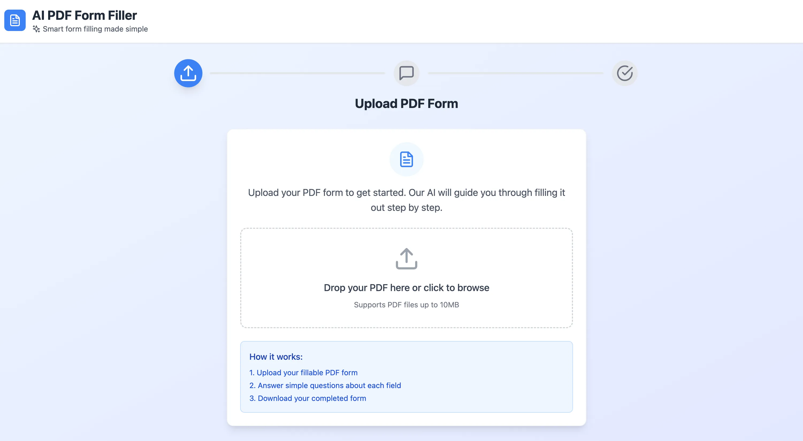
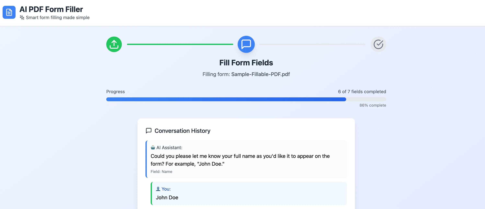
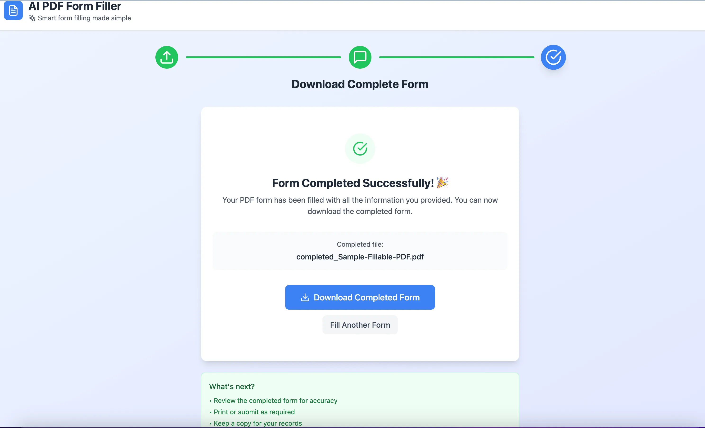

# AI PDF Form Filler App

This project is a learning experiment to build a GenAI-powered web app that helps users fill out complex PDF forms through a conversational interface.

## Features

- **Upload PDF**: Users can upload fillable PDF forms.
- **Field Extraction**: The backend extracts form fields from the PDF.
- **Conversational Guidance**: AI (GPT-4) asks users questions to gather required information.
- **Auto-Fill & Download**: The backend fills the PDF and provides a download link for the completed form.
- **Progress Tracking**: Tracks number of fields filled vs. total fields.

<p align="center">
   <strong>Upload PDF</strong><br>
   
</p>

<p align="center">
   <strong>Conversational Guidance</strong><br>
   
</p>

<p align="center">
   <strong>Download</strong><br>
   
</p>

## Tech Stack

- **Backend**: FastAPI (Python), PyMuPDF, OpenAI API, SQLAlchemy
- **Frontend**: React (Vite), Axios, Tailwind CSS
- **Database**: PostgreSQL
- **Storage**: Local filesystem (MVP)
- **Orchestration**: Docker & Docker Compose

## Getting Started

### Prerequisites
- Docker & Docker Compose
- OpenAI API Key
- Azure endpoint

### Setup

1. **Clone the repository**
   ```bash
   git clone https://github.com/StephenDsouza90/genai-pdf-form-filler.git
   cd genai-pdf-form-filler
   ```
2. **Configure environment variables**
   - Add your api key and azure endpoint to the env variable in the `docker-compose.yaml` file.
3. **Start the app**
   ```bash
   docker-compose up --build -d
   ```
4. **Access the app**
   - Frontend: [http://localhost:3000](http://localhost:3000)
   - Backend API: [http://localhost:8000/docs](http://localhost:8000/docs)

## Project Structure

```
backend/    # FastAPI backend
frontend/   # React frontend
uploads/    # PDF storage
```

## Learning Goals
- Practice GenAI integration in real apps
- Explore PDF automation
- Build fullstack apps with modern tools
